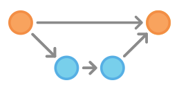

# Git Survival on the Command Line
> Software configuration management <sup>[1](#references)</sup> is
for distributed collaborative coders who need to keep
track of code changes that will be merged with other
contributions, view differences and possibly revert to
a particular commit state.


## Prerequisites

<details>
<summary>vvvvvvvv</summary>

  1. Install git

     * Linux [:link:](https://git-scm.com/download/linux)
     * Windows [:link:](https://git-scm.com/download/win)

  2. Install python3

     * Linux [:link:](https://docs.python-guide.org/starting/install3/linux/)
     * Windows [:link:](https://www.python.org/downloads/windows/)

  ```bash
  # the following examples tested with
  uname -ior
  6.5.8-200.fc38.x86_64 GNU/Linux

  python3 --version
  Python 3.11.6

  git --version
  git version 2.43.0
  ```
</details>

## Initializing a project

<details>
<summary>vvvvvvvv</summary>

  1. From an existing repository

     ```bash
     mkdir ~/workspace
     mkdir ~/workspace/temp_delete_me
     cd ~/workspace/temp_delete_me # for example

     git clone https://github.com/markusschanta/awesome-jupyter
     cd awesome-jupyter # notice that clone made a working directory
     git status
     git branch  # note only cloned default branch
     git log     # compare to Github / insights / network
                 # first seven characters of hash
     # there is no more to see here, please move along!
     cd ~
     rm -rf ~/workspace/temp_delete_me
     ```

  2. Fresh idea, no code exists yet, OR code exists but is not yet managed.

     ```bash
     mkdir ~/workspace/this_project
     cd ~/workspace/this_project # for example
     git init
     git status
     ls -al # notice the .git directory has been added

     # get a prepopulated list of Python files that git should ignore
     wget -O .gitignore "https://raw.githubusercontent.com/github/gitignore/main/Python.gitignore"
     cat .gitignore
     ```
</details>

## Authentication setup <sup>[2](#references)</sup>

<details>
<summary>vvvvvvvv</summary>

* Set a Git username and email address just for this project

  ```bash
  cd /workspace/this_project  # for example
  git config user.name "Your Name"
  git config user.email "youremail@yourdomain.com"
  # see the change
  cat ./.git/config

  ```
OR

* Set a global Git username and email address for this user

  ```bash
  git config --global user.name "Global Name"
  git config --global user.email "yourGlobalemail@yourdomain.com"
  # see the change
  cat ~/.gitconfig
  ```

* determine changes in all config files

  ```bash
  # combination of local and global configuration
  git config --list
  ```

* remove a config parameter

  ```bash
  git config --unset-all user.name
  git config --unset-all user.email
  # add --global as necessary for example
  git config --global --unset-all user.name
  git config --global --unset-all user.email

  git config --list # confirm the changes
  ```

* Caveats

  * you need to know in advance what your upstream repository will be expecting.

  * This user.email will be attached to the commits and made a permanent part of the record.

  * If you want to hide your email adress on Github see
  'About commit email addresses' [:link:](https://docs.github.com/en/github/setting-up-and-managing-your-github-user-account/setting-your-commit-email-address#about-commit-email-addresses)

* Anonymizing ones email address for Github related projects

  ```bash
  git config user.name "username"
  git config user.email "ID+username@users.noreply.github.com"
  # OR
  # depending upon membership date ( prior to July 18, 2017)
  git config user.email "username@users.noreply.github.com"
  ```
</details>

## Make code changes to a file

```bash
cd ~/workspace/this_project
echo "print('# Hello World')" >> hello-world.py
# test it
python3 hello-world.py
git status
```

## Staging the changes

```bash
git add hello-world.py
git status
```

## Commits

> See [Conventional Commits](https://conventionalcommits.org) for commit message
> guidelines and lint your message using the online tool
> [commitlint](https://commitlint.io/).

<details>
<summary>vvvvvvvvvv</summary>

* all-in-one

  ```bash
  git commit -m "add main reference to changes" -m "add more notes here"
  ```

  > Until a username and email is entered Git should refuse to continue
  here. Follow instructions from above to set.

  __OR__

* open the default editor to add the message

  ```bash
  git commit
  ```

  > `Vim` was the default editor, now changed to `nano`.
  Be prepared to use [Vim](https://vimhelp.org/) mode commands on some machines.

* Check the commit

  ```bash
  git log
  ```

* Oops! Fixing the most recent commit message

  ```bash
  git commit --amend -m "replace last commit msg" -m "with corrected notes"
  git log
  ```

* Push

  ```bash
  # Depending on your project strategy,
  # pushing after every commit is one option
  # to keep your project backed-up.
  #git push toTheRemoteRepository
  ```

</details>

## Branching (flows) 🌿

> "A branch in Git is simply a lightweight
movable pointer to one of these commits.
The default branch name in Git is `main`.
As you start making commits, you’re given a
main branch that points to the last commit
you made. Every time you commit, the main
branch pointer moves forward automatically."<sup>[3](#references)</sup>

> If you Bing 'git flow' you will find several
articles documenting flows relevant to the
authors projects. These are just ideas that
may have some relevance to a current project
or may require some customization to fit the
current needs. It is up to each project
manager / coder to define a flow that is
adequate.

We will write our flow for this lab based on
some of the following examples.  The idea is
to __document a repeatable flow__ for our purpose.

1. Git flow example<sup> [5](#references)</sup>
2. Github flow<sup> [6](#references)</sup>
3. MS continuous delivery<sup> [7](#references)</sup>
4. Classic article<sup> [8](#references)</sup>

----

## Flow Goal


> Create a develop branch from the main,
checkout a feature branch from develop, make
some commits on that feature branch, then merge
the feature branch into the develop branch. Then
merge develop into the main branch.

* Create feature branch

  ```bash
  # currently on branch main
  git branch
  git branch main    # make sure this branch exists
  git branch develop # not working straight from main
  git checkout develop
  git branch calculator-feature
  git checkout calculator-feature
  # OR
  # git checkout -b calculator-feature develop #shortcut way
  git branch # see the checked-out branch on the list
  ```

* simple_calculator.py

  We will reference some of the code from the
[unittest](https://docs.python.org/3.11/library/unittest.html) example and from a more complex [example](https://stackabuse.com/unit-testing-in-python-with-unittest/) `simple_calculator.py` .

  ```bash
  cd ~/workspace/this_project/
  # simple_calculator.py
  #   with a little hand waiving
  # https://gist.github.com/ro6ley/95cfb5c6750b57ce001dd5f505eac799

  # test_simple_calculator.py
  wget https://gist.githubusercontent.com/ro6ley/95cfb5c6750b57ce001dd5f505eac799/raw/402fc4bf53cb6bb7bf5ce8c41be90974fae600fa/test_simple_calculator.py

  python3 test_simple_calculator.py # the tests do not pass

  git status
  # note the new untracked file

  git add test_simple_calculator.py

  git status
  # note the changes to be commited

  git commit -m "test(test_simple_calculator): add file" -m "* incorporating TDD - test driven development" -m "tests failing"

  # maybe git push here
  ```

  * The tests failed because the calculator code is missing.  Get the calculator code.

  ```bash
  # simple_calculator.py
  wget https://gist.githubusercontent.com/ro6ley/95cfb5c6750b57ce001dd5f505eac799/raw/402fc4bf53cb6bb7bf5ce8c41be90974fae600fa/simple_calculator.py

  python3 test_simple_calculator.py # do the tests pass?

  git status
  # note the new untracked file
  ls # see the newly added files

  git add simple_calculator.py

  git commit -m "feat(simple_calculator): add file" -m "write code to assure the " -m "tests  are passing"

  # maybe git push here
  ```

----

### Viewing the flow

```bash
git log
git log --graph
git log --graph --oneline --decorate
git log --graph --oneline --decorate --all
# does the command line graph look something
# like the picture of our goal above?
```

----
### Merging w/ no fast forward ( keep the branch history )

```bash
git checkout develop
git merge --no-ff calculator-feature -m "merge branch calculator-feature into develop"

# maybe git push here

# see changes to the flow
git log --graph --oneline --decorate --all

git checkout main
git merge --no-ff develop -m "merge branch develop into main"

# maybe git push here

# see changes to the flow
git log --graph --oneline --decorate --all
```

----
### Tagging, annotated
> "Use this functionality to mark release points (v1.0, v2.0 and so on)"<sup>[13](#references)</sup>

On Github there are `Tags` and `Releases` links in the code tab section.  They go to the same place.  *Git tags* are how those releases are created for consumption.

```bash
git tag -a v0.0.1 -m "version 0.0.1" -m "add simple calculator"
git tag
git show v0.0.1
# see changes to the flow
git log --graph --oneline --decorate --all
```

* Special push option for tags

  ```bash
  # maybe git push here
  #git push toTheRemoteRepository --tags
  ```
----
### What is the difference?
```bash
git diff <before-commit> <after-commit>
# for example using commit references from the git log
# ( use your own references )
git diff 5e111d7 831fc17
```

----
### Going back in time to a previous commit
```bash
$ git log --graph --oneline --all --decorate
# notice where the HEAD is
*   96fdc9b (HEAD, tag: v0.0.1, main) merge branch develop into main
|\
| *   83f1760 (develop) merge branch calculator-feature into develop
| |\
|/ /
| * 831fc17 (calculator-feature) add file
| * 5e111d7 add file
|/
* 627d118 replace last commit msg

# # #

$ git checkout 627d118
Previous HEAD position was 96fdc9b... merge branch develop into main
HEAD is now at 627d118... replace last commit msg

$ git log --graph --oneline --all --decorate
*   96fdc9b (tag: v0.0.1, main) merge branch develop into main
|\
| *   83f1760 (develop) merge branch calculator-feature into develop
| |\
|/ /
| * 831fc17 (calculator-feature) add file
| * 5e111d7 add file
|/
* 627d118 (HEAD) replace last commit msg
# if necessary a new branch could be created
# from here
```

return HEAD to an attached condition, ie attached to a branch

```bash
git checkout main # for example, or any other branch name
```

----
### Pushing

> "Updates remote references using local references"

```bash
# try for a hint
git push
# first define where to push to
#   Configure a remote repository using
git remote add <name> <url>

# and then push using the remote name
git push <name>
```

This leads us to question "Which remote?"

Before moving on, let us clean-up by removing the example.

```bash
cd ~
rm -rf ~/workspace/this_project
```

----
----

## Remote repositories

>"To do collaboration with Git, you’ll need to have a
remote Git repository, ... generally a __bare__ repository
 — a Git repository that has no working directory...  In
the simplest terms, a bare repository is the contents of
your project’s `.git` directory and nothing else."

See "Setting up a remote repository" as a separate topic.

* There are many *Repositories as a Service*
  * [Github](https://github.com/)
    * For example see a graph of this project __insights -> network__ [:link:](https://github.com/cs-south-sound/curtain-raiser/network)
  * [Gitlab](https://about.gitlab.com/)
    * in IBM Cloud Continous Delivery Service docs [:link:](https://cloud.ibm.com/docs/ContinuousDelivery?topic=ContinuousDelivery-git_working)
  * [Bitbucket](https://bitbucket.org/) from Atlassian
  * [Launchpad](https://launchpad.net/)

  * Google [Cloud Source](https://cloud.google.com/source-repositories/) Repositories
  * AWS [Code Commit](https://aws.amazon.com/codecommit/)
  * [codeberg](https://codeberg.org/)

* Self hosted
  * [Gitlab](https://about.gitlab.com/install/)
  * [Gitea](https://gitea.io/en-us/)
  * [Gogs](https://gogs.io/)
  * Apache [Allura](https://allura.apache.org/)

----

## Reference

1. SCM: https://en.wikipedia.org/wiki/Software_configuration_management

2. git-config: https://git-scm.com/docs/git-config

* Branches

  3. book: https://git-scm.com/book/en/v2/Git-Branching-Branches-in-a-Nutshell

  4. docs: https://git-scm.com/docs/git-branch

* Flows

  5. https://leanpub.com/git-flow/read

  6. Github flow: https://guides.github.com/introduction/flow/

  7. Continuous delivery: https://docs.microsoft.com/en-us/archive/blogs/technet/devops/a-git-workflow-for-continuous-delivery

  8. Classic article: https://nvie.com/posts/a-successful-git-branching-model/

  9. Other stratgies: https://webdevstudios.com/tags/git/

  10. Git merge no fast forward: https://linuxhint.com/git_merge_noff_option/

  11. Understanding Git: on developer.ibm [:link:](https://web.archive.org/web/20201029205557/https://developer.ibm.com/technologies/web-development/tutorials/d-learn-workings-git/)

12. Github blocking personal email pushes: https://docs.github.com/en/github/setting-up-and-managing-your-github-user-account/blocking-command-line-pushes-that-expose-your-personal-email-address

13. Tagging: https://git-scm.com/book/en/v2/Git-Basics-Tagging

14. git-diff: https://git-scm.com/docs/git-diff

15. IBM garage method, gitlab: https://www.ibm.com/garage/method/practices/code/tool_gitlab

* Youtube

   * cs-south-sound
     * this tutorial [:link:]()
     * playlist [:link:](https://www.youtube.com/playlist?list=PL-j7VyctKguuCO8WkzaYauh4NosbtGLC_)